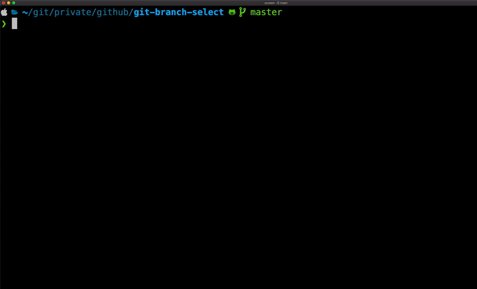

# BS

Tool for rapid selecting and changing git branch.  
List and switch branch in single command.



# Installation

## Linux, MacOS X

Execute in terminal

```bash
curl -s "https://raw.githubusercontent.com/stawirej/git-branch-select/master/install/install.sh" | bash
```

### Alternative

1. Clone [git-branch-select](https://github.com/stawirej/git-branch-select) repository.
2. Add execution rights for `src/` content.
3. Add `src/` to PATH.

## Windows

When using git bash within [Git for Windows](https://git-for-windows.github.io/), the scripts can simply be put in `usr\bin`
in the installation directory. That directory usually is `C:\Program Files\Git\usr\bin`.

1. Download [zipped repository](https://github.com/stawirej/git-branch-select/archive/refs/heads/master.zip)
2. Unzip the package
3. Copy everything from `src/` into `C:\Program Files\Git\usr\bin`
